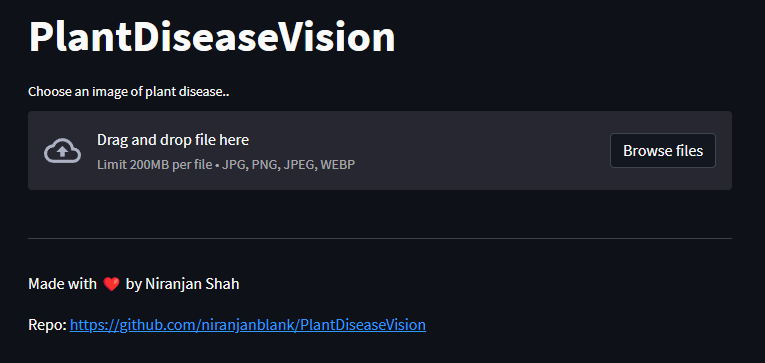
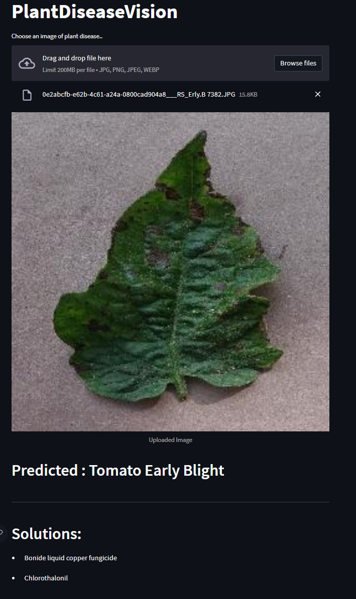

## PlantDiseaseVision
PlantDiseaseVision is an application designed to identify and diagnose plant diseases using computer
vision techniques. This application uses transfer learning on a pre-trained ResNet50 model to predict 
the classes of diseases in plants. It is trained on the New Plant Disease dataset available on Kaggle, 
which contains 38 classes of plant diseases.

### Requirements
To run this application, you need the following libraries as specified in requirements.txt
* pillow
* pytorch
* numpy 
* streamlit

### Dataset
The [New Plant Disease dataset](https://www.kaggle.com/datasets/vipoooool/new-plant-diseases-dataset) from Kaggle is used to train the model. This dataset consists 
of images of healthy and diseased plants from various classes, such as Apple Scab, Apple Black Rot, 
Grape Leaf Blight, etc. Each class represents a different plant disease.

### Transfer Learning
Transfer learning is applied to the pre-trained ResNet50 model available in PyTorch. 
The model is fine-tuned on the New Plant Disease dataset to adapt it for the specific task of plant 
disease classification. By using transfer learning, the model can leverage the pre-trained knowledge of 
the ResNet50 architecture, resulting in better accuracy and faster training.

### Loading Class Label and solution to the disease
The info.json file contains information about each plant disease class. 
It includes details such as the disease name and recommended treatments or preventive measures. 
The application retrieves the information based on the predicted class and displays it to the user.

### Usage
You can test this application at [PlantDiseaseVision](https://niranjanblank-plantdiseasevision-streamlit-app-5w8lq5.streamlit.app/)
deployed using streamlit.

Or

You can set this in your local machine using the following steps
1. Clone the repository
2. Install the required libraries as in requirements.txt
3. Run the `steamlit_app.py` using `streamlit run streamlit_app.py`
4. You can upload the file in the application and view the output

### Output
The PlantDiseaseVision application provides the following outputs:

Predicted Class: The predicted class of the plant disease based on the input image.

Solution: The solution or recommendations for addressing the specific plant disease. 
The information is obtained from the info.json file, which contains details 
about each disease class.

#### Initial Landing Page

#### Prediction

